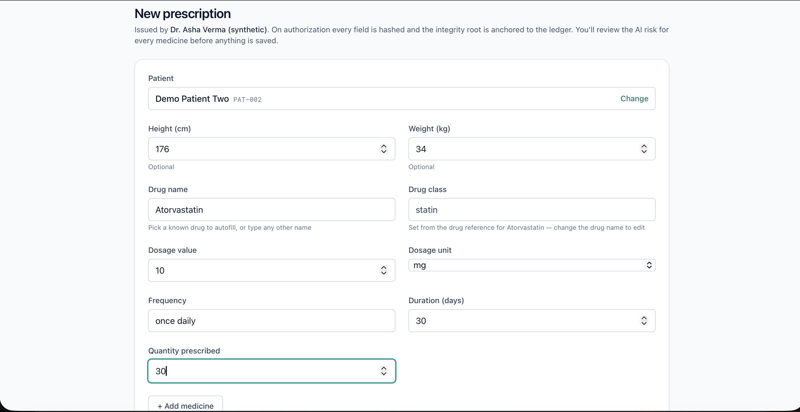
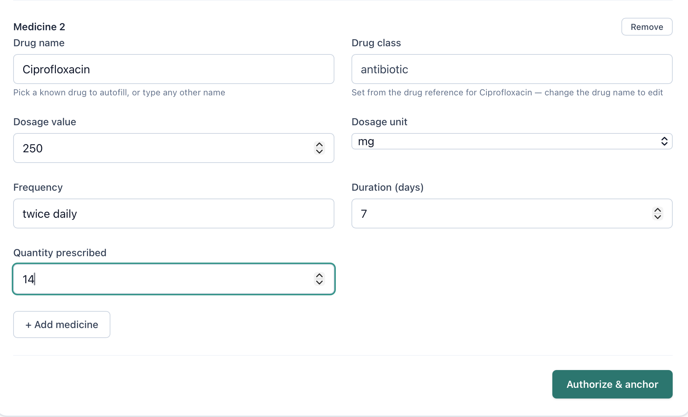
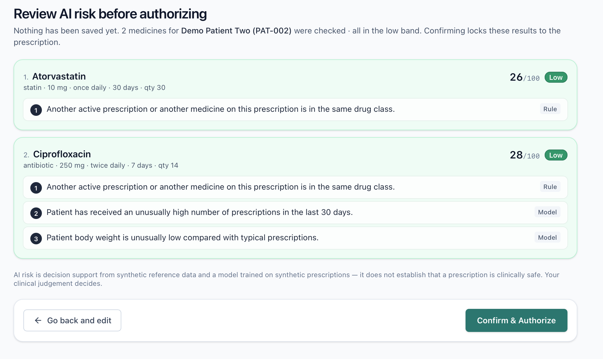
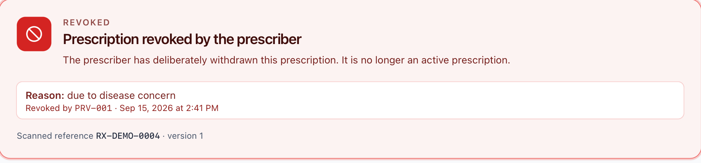
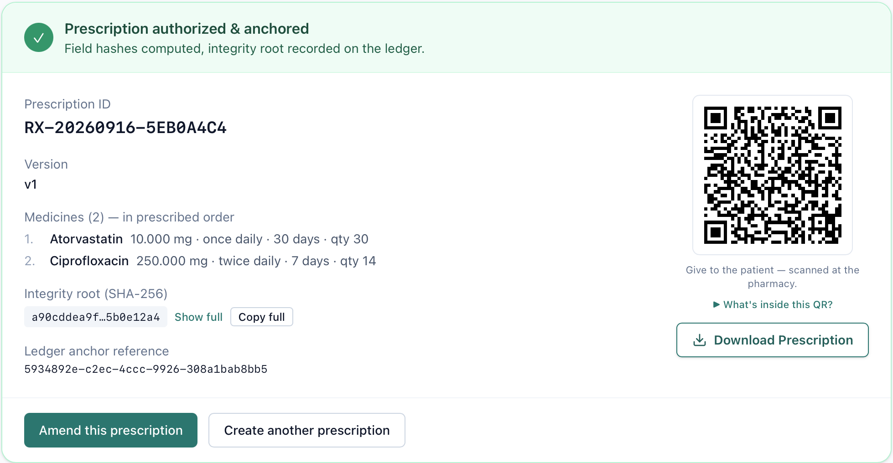
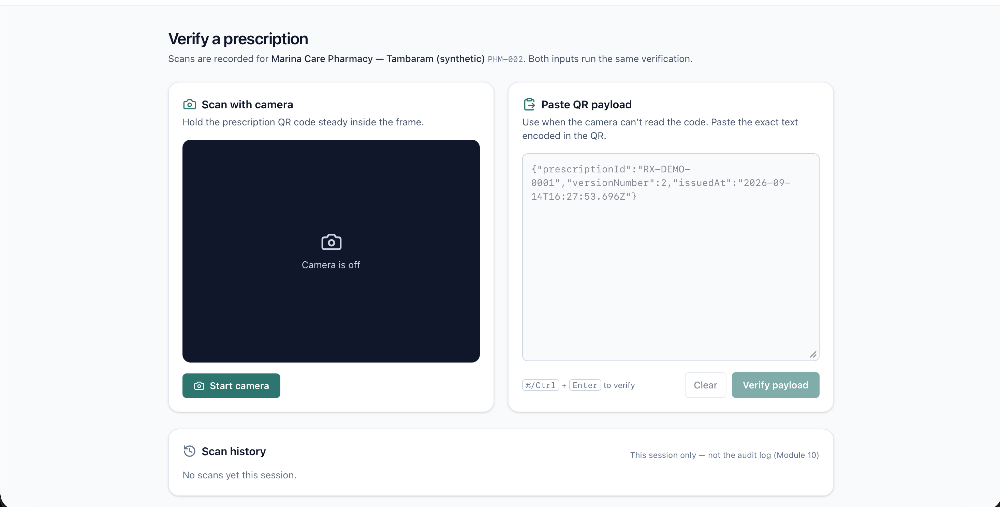
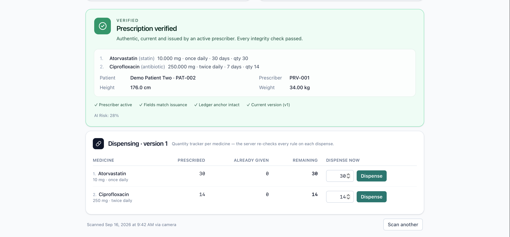
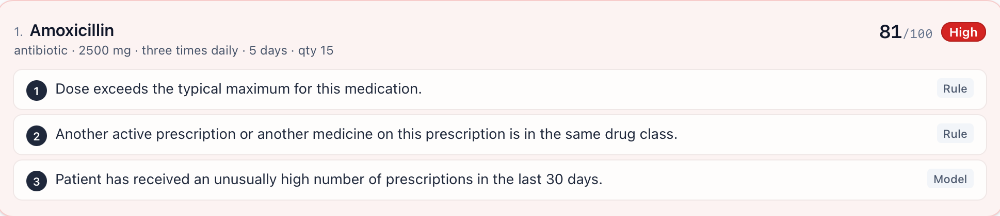
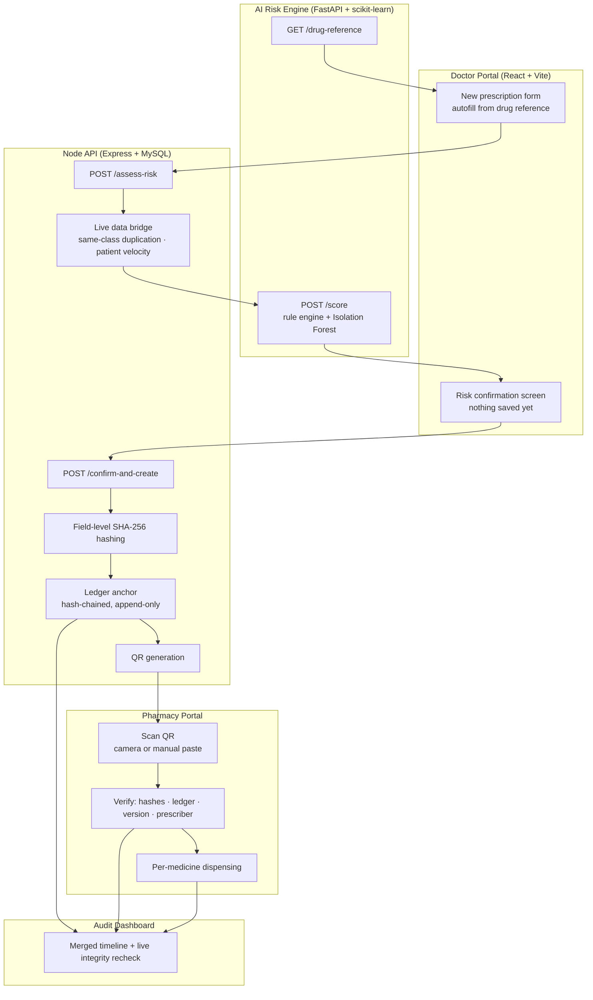

# Anchor Rx

**Trust what was prescribed. Detect what was changed. Flag what deserves review.**


<!-- TODO screenshot: landing page hero — save as docs/screenshots/landing-page.png -->

---

## Overview

Anchor Rx is a tamper-evident digital prescription platform for doctors, pharmacies and auditors. It answers two
different questions that existing prescription systems tend to blur together. **Cryptographic integrity** answers *"was
this prescription changed after it was issued?"* — every field is hashed individually with SHA-256 and the resulting
integrity root is anchored to an append-only hash-chained ledger, so a pharmacist sees not just *that* something was
altered but exactly *which field*. **AI risk scoring** answers a separate question — *"does this prescription deserve a
second look?"* — using a hybrid of a rule engine and an Isolation Forest anomaly model, shown to the prescriber before
anything is saved and then locked permanently to the prescription.

Those two answers stay independent on purpose: an authentic prescription can still be risky, and a low-risk
prescription can still have been tampered with. Built for **VMEDITHON 3.0** by team **Code Syndicate**.

## The Problem

A prescription can fail in three different ways, and today's systems usually cannot tell them apart:

- **Silently altered.** A dosage, quantity or duration is changed after the prescriber signed it. A paper or PDF
  prescription carries no evidence of the edit, and the pharmacy has no way to compare it against what was issued.
- **Forged.** A prescription that was never issued by a real prescriber at all, or one reused after it was revoked or
  already dispensed.
- **Unusual but authentic.** Genuinely issued, unaltered, and still worth a second look — an overdose, two medicines of
  the same therapeutic class, or a patient collecting prescriptions unusually fast.

Verification alone cannot catch the third case, and risk scoring alone cannot catch the first two. Anchor Rx runs both
and keeps their answers separate.

## Key Features

Every item below is implemented in this repository; the ones that are **not** built are listed in
[Design Notes & Honest Limitations](#design-notes--honest-limitations).

- **Field-level SHA-256 hashing with exact tamper localization** — each field is hashed separately with a per-version
  salt, so verification names the changed field (e.g. `medicine_2.dosage_value`) instead of only failing the record.
  Hash keys are bound to a medicine's position, so reordering medicines is detectable too.
- **Hash-chained ledger (a prototype of blockchain anchoring, not a deployed chain)** — every version's integrity root is
  appended with the previous entry's hash, making retroactive edits detectable. Append-only by construction, serialized
  by a database mutex so concurrent writes cannot fork the chain.
- **Full version history** — amendments and revocations create new versions rather than editing rows, with a parent
  chain, per-version diffs, and delegated-amendment authorization rules.
- **Multi-medicine prescriptions with per-medicine dispensing** — quantities are tracked per medicine, partial dispensing
  is supported, and every dispense re-checks integrity and remaining quantity under a row lock.
- **Hybrid AI risk scoring with doctor-side confirmation and permanent locking** — an Isolation Forest model plus a rule
  engine score every medicine, with ranked plain-English reasons. The prescriber reviews the result before anything is
  saved, and the score shown is written into the same database transaction as the hashing and the ledger anchor. A
  database trigger makes it write-once: retraining the model never changes a historical prescription's recorded risk.
- **Live risk features from real prescription data** — same-class duplication and patient prescription velocity are
  computed from the database at scoring time, not from static sample values.
- **Graceful AI degradation** — if the risk engine is unreachable, the medicine is shown as *"AI risk assessment
  unavailable"* and still requires explicit confirmation; the safeguard is never silently skipped.
- **Medicine autofill from a single source of truth** — the drug reference table lives only in the Python service and is
  relayed to the portal, which autofills dose, unit, frequency, duration and class, and locks the class for known drugs
  to protect exact-match duplication checks from typos.
- **QR-based pharmacy verification** — camera scanning with a manual payload-paste fallback; every scan outcome
  (verified, tampered, forged, stale version, revoked, unknown, inactive prescriber) is a first-class result.
- **Audit timeline and provenance dashboard** — a merged historical timeline per prescription, a live integrity recheck
  computed on demand, and a filterable summary list flagging prescriptions that fail verification now.
- **Printable prescription documents** — one-page PDF per exact version, with the QR regenerated from that version.

## Screenshots

*Screenshots below are from a live local demo run — see [Getting Started](#getting-started) to run it yourself.*

### Doctor Portal — New Prescription

Autofill from the drug reference fills dose, unit, frequency and duration; the drug class is locked for known drugs.



### Doctor Portal — Multiple Medicines

A second medicine on the same prescription, ending in **Authorize & anchor**.



### AI Risk Confirmation

Nothing is saved yet. Each medicine shows its score, band, and ranked reasons labelled `Rule` or `Model` — here the
same-drug-class duplication reason fires for both medicines.



### AI Risk — High Band

A 2500 mg Amoxicillin scoring 81/100 with the overdose named first.



### Prescription Authorized & Anchored

Integrity root, ledger anchor reference and the patient's QR code.



### Pharmacy Portal — Scan

Camera scanning with a manual payload-paste fallback.



### Pharmacy Portal — Verified Scan

Every integrity check passed, with the per-medicine dispensing panel below.



### Pharmacy Portal — Revoked Prescription

A prescription the prescriber withdrew, blocked at the pharmacy with the recorded reason.



### Pharmacy Portal — Tampered Scan

*Not yet captured.* Run `npm run demo:tamper` and scan the tampered prescription to produce this.


<!-- TODO screenshot: tampered/blocked scan result — save as docs/screenshots/pharmacy-tampered.png -->

### Audit Timeline

*Not yet captured.* Open the Audit Dashboard and select the tampered-dosage demo prescription.


<!-- TODO screenshot: audit timeline for the tampered-dosage demo prescription — save as docs/screenshots/audit-timeline.png -->

### ML Performance Dashboard

*Not built.* Model evaluation currently lives in `ai-service/evaluation/report.md`, not in a UI screen.

<!-- TODO (feature not built): ML performance dashboard — docs/screenshots/ml-dashboard.png -->

## Architecture



The risk score the prescriber sees at **B** is the exact value written at **E**, in the same transaction as **F** and
**G**. It is never recomputed at confirmation time and never changed afterwards.

## Tech Stack

| Layer | Technology |
|---|---|
| **Frontend** | React 19, Vite 8, TypeScript 7, Tailwind CSS 4 (Doctor, Pharmacy and Audit portals in one app) |
| **Backend** | Node.js, Express 5, MySQL 8 (`mysql2`), Jest 30 |
| **AI Service** | Python 3.13, FastAPI, scikit-learn (Isolation Forest), pandas, NumPy, pytest |
| **Integrity** | SHA-256 field-level hashing with per-version salts (Node `crypto`) |
| **Ledger** | Hash-chained append-only MySQL table (prototype of blockchain anchoring) |
| **QR** | `qrcode` (generation), `jsqr` (decode in tests), in-browser camera scanning |
| **Auth** | ⚠️ Not built — prototype uses mock identity selection (see Limitations) |

## Getting Started

### Prerequisites

- Node.js 20+ (developed on 24.14)
- Python 3.13
- MySQL 8 running locally (developed on 8.4)

### 1. Clone and install Node dependencies

```bash
git clone <your-repo-url> anchor
cd anchor
npm install
npm --prefix frontend/doctor-portal install
```

### 2. Create the databases and apply migrations

```bash
mysql -uroot -e "CREATE DATABASE anchor_rx; CREATE DATABASE anchor_rx_test;"
```

Migrations are plain SQL files applied in filename order (there is no migration runner script):

```bash
for db in anchor_rx anchor_rx_test; do for f in backend/db/migrations/*.up.sql; do mysql -uroot "$db" < "$f"; done; done
```

### 3. Configure environment variables

```bash
cp .env.example .env
```

`.env` is gitignored and holds your local database credentials and the AI service URL. See `.env.example` for the full
list — no secrets are committed to this repository.

### 4. Install Python dependencies

```bash
cd ai-service
python3 -m venv .venv
.venv/bin/pip install -r requirements.txt
cd ..
```

### 5. Seed demo data

```bash
npm run seed          # reference data + demo prescriptions (includes the named demo fixture)
npm run demo:tamper   # optional: adds the tampered-dosage demo prescription
```

### 6. Start all three services (three terminals)

```bash
npm run api                                                    # terminal 1 — Node API on :4000
npm run doctor-portal                                          # terminal 2 — portal on :5173
cd ai-service && .venv/bin/uvicorn main:app --port 8000        # terminal 3 — AI risk engine on :8000
```

Open <http://localhost:5173>. All three must be running: the portal calls the Node API, which calls the AI risk engine
for every medicine scored.

## Running Tests

```bash
npm test                                          # backend: Jest against anchor_rx_test (486 tests)
cd ai-service && .venv/bin/python -m pytest       # AI service: pytest
npm --prefix frontend/doctor-portal run build     # frontend: typecheck + production build
```

The Jest suite refuses to run against any database whose name does not end in `_test`.

## Project Structure

```
anchor/
├── backend/          Node/Express API — hashing, ledger, versioning, dispensing, audit, risk orchestration
│   ├── api/          HTTP routes (thin wrappers; all logic lives in the modules below)
│   ├── db/           MySQL connection, SQL migrations, repositories, demo seed scripts
│   ├── integrity/    Field-level SHA-256 hash engine
│   ├── ledger/       Hash-chained append-only ledger service
│   ├── ml/           Risk assessment orchestration, live data bridge, AI service client
│   ├── qr/           QR generation and pharmacy scan verification
│   └── tests/        Jest suites (one per module)
├── frontend/
│   └── doctor-portal/  React + Vite app: Doctor, Pharmacy and Audit portals
├── ai-service/       Python FastAPI risk engine
│   ├── data/         Drug reference table + synthetic corpus generator
│   ├── features/     Feature extraction (15 features)
│   ├── rules/        Deterministic rule engine
│   ├── train/        Isolation Forest training + saved model artifacts
│   ├── evaluation/   Evaluation harness and published metrics report
│   └── tests/        pytest suites
└── docs/             Screenshots and demo QR payloads
```

## Design Notes & Honest Limitations

This section documents exactly what was built and what was not. We consider it a strength of the submission, not
something to hide.

**The ledger is a hash-chained mock, not a blockchain.** It demonstrates the same tamper-evidence property a real chain
would provide — each entry commits to the previous one, so retroactive edits are detectable — but it is a single MySQL
table, not a distributed network with consensus. Entries are labelled `anchor_type = 'mock'` in the database, and the
service interface (`anchorEntry`, `verifyChainIntegrity`) was written so a real chain could replace it without touching
the callers. A public chain was deliberately out of scope: cost per write, latency, and the irreversibility of putting
health-related records on a permanent public ledger.

**The AI model is trained entirely on synthetic data.** The Isolation Forest (300 trees, fixed seed) was trained on
4,000 generated "normal" prescriptions — no real patient data was used at any point. Measured on a held-out synthetic
set of 1,000 anomalous and 997 normal prescriptions, treating `review` or `high` as a positive prediction:

| Metric | Value |
|---|---|
| Precision | 99.4% |
| Recall | 64.1% |
| F1 | 77.9% |
| False positive rate | 0.4% |
| Confusion matrix | TP 641 · FP 4 · FN 359 · TN 993 |

Component breakdown from the same run: the rule engine alone reaches 100% precision at 60% recall; the model alone
reaches 96.2% precision at 27.6% recall. Combining them is what produces the hybrid figure above. **Roughly 36% of
abnormal prescriptions are missed**, so this is decision support that flags prescriptions for human review — it never
blocks a prescription, and it never establishes that one is clinically safe. Full report:
`ai-service/evaluation/report.md`.

**Drug reference ranges are simplified illustrative values.** The 17-drug reference table contains commonly-cited adult
ranges for demonstration only. It is not individualized clinical dosing guidance and must not be used as such.

**Authentication is not implemented.** The portals use mock identity selection — the doctor picks a seeded provider, the
pharmacy picks a seeded pharmacy, and the audit dashboard is entered by clicking a link. No API route requires a token,
so anyone who can reach the API can call it. A JWT design (login endpoints, `requireAuth` role middleware, bcrypt
password hashing) has been scoped as the next module but is **not** built.

**Other known gaps:**

- Amendments are not risk-scored or risk-locked; the assess-and-confirm flow covers prescription creation only.
- Model evaluation metrics live in a generated report file; there is no in-app ML performance dashboard and no
  `model_evaluation_runs` table.
- The saved model still reports itself as `isolation-forest-placeholder-v1`.
- Drugs outside the 17-drug reference (e.g. a topical gel) are handled by a neutral fallback path rather than being
  scored on their own terms.
- Three pytest demo-case assertions currently fail: a same-class duplication scores 25 (low band) and a 5× overdose
  scores 45 (review band). Both fire the correct reason; the open question is how many points each rule should carry,
  which is a scoring-policy decision rather than a defect.

## Team

**Code Syndicate** — VMEDITHON 3.0, Bio × Engineering track.

<!-- TODO: add team member names and roles here -->

| Member | Role |
|---|---|
| _TODO_ | _TODO_ |

## License

Released under the [MIT License](LICENSE).
